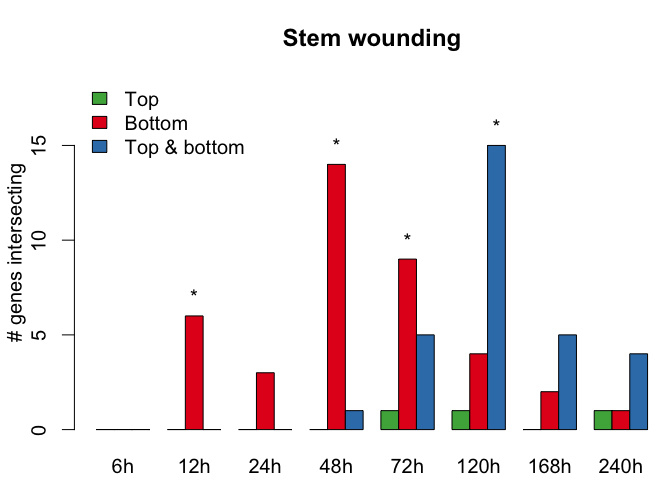

Reproducible script
================
Alexander Gabel
12 9 2017

Differential auxin and sugar responses are involved in tissue recognition and graft formation in *Arabidopsis thaliana*
-----------------------------------------------------------------------------------------------------------------------

### Installation of necessary packages

Install and load packages containing the functions for the analyses

``` r
install.packages("devtools")
install.packages("readxl")
devtools::install_github("GraftingScripts")
library("GraftingScripts")
```

### Load expression data

Loading length normed expression data generated by BaySeq

``` r
data(exp.data)
```

Next, we calculate the corresponding TPM values based on the length normed data and also the TPM expression matrix based on the summarized replicates.

``` r
exp.data.tpm <- apply(exp.data,2,function(i)i/sum(i)*10^6)
exp.data.tpm.sum <- sapply(seq(1,by=2,length.out=ncol(exp.data)/2),function(i){
                           # calculating the geometric mean of biological replicates
                           exp_col <- exp(rowMeans(log(exp.data[,c(i,i+1)]))) 
                           exp_col/sum(exp_col) * 1e6
                           })
colnames(exp.data.tpm.sum) <- gsub(pattern = "A|B", replacement = "h", 
                                   x = colnames(exp.data)[seq(1, by=2, length.out = ncol(exp.data)/2)])
```

### Generating dendrogram based on summarized replicates

``` r
data(groupsT)
plot_colored_dendrogram(exp_data = log10(exp.data.tpm.sum+1), groups = groupsT)
```


### Generating PCA plot

``` r
plotPCA(exp_data = exp.data.tpm.sum, plot_time_points = T, groups = groupsT, do.MDS = F, cex=5, do.legend = T, log=T)
```


### Calculate Fold changes against the intact samples

``` r
fc.exp.data <- exp.data.sum[,-which(colnames(exp.data.sum.tpm) %in% "0h Intact")]
fc.list <- list()
sample.Indices <- 9:16
for(i in 1:(ncol(fc.exp.data)/8-1)){
  fc.list[[i]] <- log2(fc.exp.data[,sample.Indices]+1) - log2(fc.exp.data[,1:8]+1)
  sample.Indices <- sample.Indices + 8 
}
names(fc.list) <- unique(unlist(lapply(strsplit(x=colnames(fc.exp.data),split=" "),function(i)paste(i[-1],collapse = " "))))[-1]
```

### Integrate the marginal likelihoods from BaySeq

``` r
data(ml.list.up)
data(ml.list.down)
```

### Load the gene sets from previous publications

``` r
library(readxl)
xl_file <- "data/all_gene_subsets_from_manuscript_original.xlsx"
sheet_names <- excel_sheets(xl_file)
gene_lists <- list()

for(i in seq_along(sheet_names)){

  gset <- as.matrix(read_excel(xl_file,sheet = sheet_names[i], col_names = F))[,1]
  gset <- unlist(lapply(strsplit(x = gset,split = ";| /// "),function(i)i[1:length(i)]))
  gset <- gsub(pattern = "\\*| ",replacement = "",x = gset)

  # separate gene_ids (beginning with AT) from possible probe_ids (beginning with numbers)
  gset_gene_ids <- gset[grepl(pattern = "^AT", x = gset, ignore.case = T)]
  gset_probe_ids <- gset[grepl(pattern = "^[0-9]", x = gset, ignore.case = T)]

  if(length(gset_probe_ids) > 0){
    # convert probe ids into gene ids with biomartr
    gset_gene_ids_from_probes <- biomartr::biomart(genes = gset_probe_ids, mart = "plants_mart", 
                                                   dataset = "athaliana_eg_gene", filters = "affy_ath1_121501", 
                                                   attributes = "ensembl_gene_id")[,2]
    gset <- unique(toupper(gset_gene_ids_from_probes), toupper(gset_gene_ids))
  }else{
    gset <- unique(toupper(gset_gene_ids))
  }
  gene_lists[[i]] <- gset
}
names(gene_lists) <- sheet_names
```

### Calculate transcriptional overlap plots and check significance

``` r

data(exp.data)
data(fc.list)
data(ml.list.down)
data(ml.list.up)

set.seed(10)
gene_lists[[length(gene_lists)+1]] <- sample(250, x=rownames(exp.data))
gene_lists[[length(gene_lists)+1]] <- sample(500, x=rownames(exp.data))
 
names(gene_lists)[(length(gene_lists)-1):(length(gene_lists))] <- c("250_random","500_random")

for(fc in 1:3){
  
  plot_dir <- paste0("Histogram_abs_logfc_gt_",fc,"_and_ML_gt_0.9")
  
  if(!file.exists(plot_dir)){
    dir.create(plot_dir)
  }
  
  fisher_res_list <- p_val_list <- list()
  
  for(i in seq_along(gene_lists)){
    fisher_res_list[[i]] <- do.fisher.test(fc.list, fg.ids=gene_lists[[i]], ml.list.up, ml.list.down, 
                                           fc.threshold = fc, ml.threshold=0.9, alternative = "two.sided")
    p_val_list[[i]] <- fisher_res_list[[i]]$p.val.mat
  }
  
  names(fisher_res_list) <- names(p_val_list) <- names(gene_lists)
  # adjusting p-values with Benjamini & Yekutieli
  adjusted_p_mat_list <- adjust_and_split(p_val_list, "BY")
  names(adjusted_p_mat_list) <- names(p_val_list)
  
  for(i in seq_along(gene_lists)){
    
    glist_name <- names(gene_lists)[i]
    
    up_fc <- fisher_res_list[[i]]$fg.up_fc
    down_fc <- -fisher_res_list[[i]]$fg.down_fc
    
    rownames(up_fc) <- names(ml.list.up)
    rownames(down_fc) <- names(ml.list.down)
    
    rel_up_mat <- t(up_fc/length(fisher_res_list[[i]]$fg.ids))
    rel_down_mat <- t(down_fc/length(fisher_res_list[[i]]$fg.ids))
    
    names_arg <- gsub(pattern = " ",replacement = "\n",rownames(up_fc))
    rect_names <- unlist(lapply(strsplit(colnames(fc.list[[1]])," "),function(l)l[1]))
    
    mainText <- paste0(glist_name," (",length(fisher_res_list[[i]]$fg.ids)," genes)")
    
    filename_prefix <- paste0(plot_dir,"/Histogram_", glist_name)

    pdf(paste0(filename_prefix,"_abs_logFC_gt_",fc,"_ml_gt_09.pdf"),width = 9,height = 6)
    par(mar=c(3.1,4.1,3.1,.1), cex=1.5)
    barplot_up_down(up_mat = rel_up_mat, down_mat = rel_down_mat, p_val_mat = adjusted_p_mat_list[[i]], names.arg = rep(rect_names,4), 
                    main = mainText, labels = names_arg)
    dev.off()
    
  }
}
```

### Defining symmetrically and asymmetrically expressed genes (Table 1)

``` r
# load genes that are symmetrically or asymmetrically expressed based on BaySeq filtering
data(atg_list)
data(exp.data)
data(gene_lists)
number_genes <- nrow(exp.data)

p.val.mat <- exp_num_overlap_genes <- obs_num_overlap_genes <- matrix(nrow=length(gene_lists), ncol=length(atg_list))
num_gene_atg_list <- unlist(lapply(atg_list, length))

for(i in seq_along(gene_lists)){

  glist_name <- names(gene_lists)[i]
  gset <- gene_lists[i]
  
  print(glist_name)
  for(j in seq_along(atg_list)){
  
    obs_num_overlap_genes[i,j] <- length(intersect(sort(gene_lists[[i]]), sort(atg_list[[j]])))
    N.table <- matrix(nrow = 2, c(number_genes - length(unique(c(atg_list[[j]], gene_lists[[i]]))), 
                        length(setdiff(sort(gene_lists[[i]]), sort(atg_list[[j]]))),
                        length(setdiff(sort(atg_list[[j]]), sort(gene_lists[[i]]))), 
                        obs_num_overlap_genes[i,j]))

    p.val.mat[i,j] <- fisher.test(N.table, alternative = "greater")$p.value
  }
}
colnames(p.val.mat) <- names(atg_list)
rownames(p.val.mat) <- names(gene_lists)

# Correction of p-values
p.adjusted.mat <- matrix(nrow = nrow(p.val.mat), ncol = ncol(p.val.mat), p.adjust(p.val.mat, method = "BY")) 

rownames(p.adjusted.mat) <- rownames(p.val.mat)
colnames(p.adjusted.mat) <- colnames(p.val.mat)

# Summarizing the results, equivalent to Table 1
baySeq_conditions <- c( "Symm", "Asym_tGb", "Asym_bGt")
names(baySeq_conditions) <- c("Graft Bottom = Top", "Graft Top > Bottom", "Graft Bottom > Top")

sym_asym_table_list <- list()

for(i in seq_along(gene_lists)){
  
  glist_name <- names(gene_lists)[i]
  
  cond_list <- list()
  for(cond in seq_along(baySeq_conditions)){
  
    indices <- grepl(x = colnames(p.adjusted.mat), pattern = baySeq_conditions[cond])
    cond_list[[cond]] <- data.frame(HAG=unlist(lapply(strsplit(x = grep(x = colnames(p.adjusted.mat), pattern = baySeq_conditions[cond], value = T), 
                                                               split = "_"), function(c_name)c_name[1])),
                                    Treatment = rep(length(gene_lists[[i]]),8),
                                    baySeq_Condition = num_gene_atg_list[indices],
                                    Overlap = obs_num_overlap_genes[i, indices], 
                                    check.names = F)
    cond_list[[cond]] <- data.frame(cond_list[[cond]], '%' = round((cond_list[[cond]]$Overlap/cond_list[[cond]]$baySeq_Condition)*100), check.names=F )
    sig_overlap <- p.adjusted.mat[i,indices] < 0.05
    cond_list[[cond]]$`%`[sig_overlap] <- paste0(cond_list[[cond]]$`%`[sig_overlap], "*")  
    colnames(cond_list[[cond]])[2:3] <- c(names(gene_lists)[i],names(baySeq_conditions)[cond])
  }
   sym_asym_table_list[[i]] <- data.frame(cond_list, check.names=F)
}
names(sym_asym_table_list) <- names(gene_lists)
devtools::use_data(sym_asym_table_list)
```

| HAG |  S2\_S3h\_CSt3h\_down|  Graft Bottom = Top|  Overlap| %   | HAG |  S2\_S3h\_CSt3h\_down|  Graft Top &gt; Bottom|  Overlap| %   | HAG |  S2\_S3h\_CSt3h\_down|  Graft Bottom &gt; Top|  Overlap| %    |
|:----|---------------------:|-------------------:|--------:|:----|:----|---------------------:|----------------------:|--------:|:----|:----|---------------------:|----------------------:|--------:|:-----|
| 6   |                  1998|                4988|      107| 2   | 6   |                  1998|                   6679|       53| 1   | 6   |                  1998|                   4971|     1563| 31\* |
| 12  |                  1998|                3473|       68| 2   | 12  |                  1998|                   7111|      112| 2   | 12  |                  1998|                   5657|     1526| 27\* |
| 24  |                  1998|                4135|       88| 2   | 24  |                  1998|                   6873|       72| 1   | 24  |                  1998|                   4942|     1525| 31\* |
| 48  |                  1998|                3689|      113| 3   | 48  |                  1998|                   6601|       93| 1   | 48  |                  1998|                   4915|     1427| 29\* |
| 72  |                  1998|               10421|      530| 5   | 72  |                  1998|                   2459|      111| 5   | 72  |                  1998|                   2019|      538| 27\* |
| 120 |                  1998|               15012|      979| 7   | 120 |                  1998|                   1510|       84| 6   | 120 |                  1998|                    941|      210| 22\* |
| 168 |                  1998|               20620|     1615| 8\* | 168 |                  1998|                    464|       25| 5   | 168 |                  1998|                    339|       26| 8    |
| 240 |                  1998|               22586|     1736| 8\* | 240 |                  1998|                    321|       32| 10  | 240 |                  1998|                    230|       26| 11   |

### Expression of DEGs during graft formation

``` r
data(baySeq_grafting_lists)
data(graft_gene_lists)
data(exp.data)
geneUniverse <- rownames(exp.data)
intersect_lists <- list()
for(i in seq_along(graft_gene_lists)){
  
  pub_gene_set <- graft_gene_lists[[i]]
  
  count_mat <- matrix(nrow=length(baySeq_grafting_lists), ncol=8) # 8 time points
  pval_mat <- matrix(nrow=length(baySeq_grafting_lists), ncol=8)
  col_names <- c()
  intersect_lists[[i]] <- list()
  
  for(treat in seq_along(baySeq_grafting_lists)){
  
    sub_list <- baySeq_grafting_lists[[treat]]
    cur_col <- 1
    
    merge_gene_ids <- c()
    
    for(j in seq_along(sub_list)){
      
      check_list <- list(sub_list[[j]], pub_gene_set)
      names(check_list) <- c(names(sub_list)[j], names(graft_gene_lists)[i])
      
      inter_stats <- intersect.analysis(gene.list = check_list, geneUniverse = geneUniverse, alternative = "greater")
      
      count_mat[treat, j] <- inter_stats$stat[1]
      pval_mat[treat, j] <- inter_stats$stat[2]
      
      if(treat == 1){
        col_names <- c(col_names, paste0(names(sub_list)[j],"h_",names(graft_gene_lists)[i]))
      }
    }
  }
  
  rownames(count_mat) <- rownames(pval_mat) <- names(baySeq_grafting_lists)
  colnames(count_mat) <- colnames(pval_mat) <- col_names
  
  intersect_lists[[i]][[1]] <- count_mat
  intersect_lists[[i]][[2]] <- pval_mat
  names(intersect_lists[[i]]) <- c("Counts","Pvalues")
}
names(intersect_lists) <- names(graft_gene_lists)

adjusted_p_mat_list <- GraftingScripts::adjust_and_split(lapply(intersect_lists, function(mat_list) mat_list[[2]]), "BY")
names(adjusted_p_mat_list) <- names(graft_gene_lists)

for(i in seq_along(intersect_lists)){
  #par(mar=c(3.1,3.1,3.1,.1), xpd=F, mgp=c(2,1,0), cex=1.5)
  GraftingScripts::barplot_graft_formation(count_mat = intersect_lists[[i]]$`Counts`, 
                                           pval_mat = adjusted_p_mat_list[[i]], main = names(intersect_lists)[i])
  intersect_lists[[i]][[3]] <- adjusted_p_mat_list[[i]]
  names(intersect_lists[[i]])[3] <- "adjusted.Pvalues"
}
```


