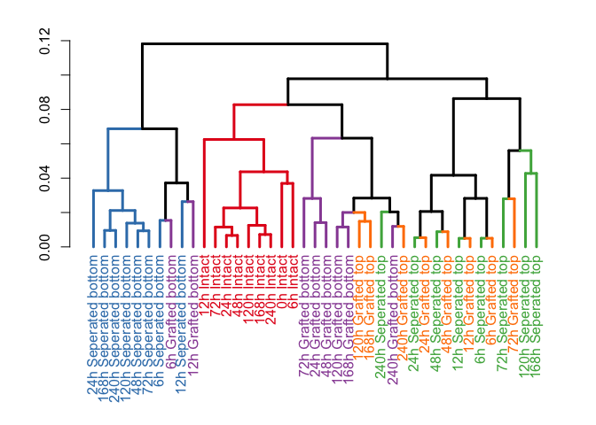
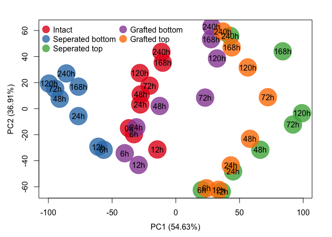

Reproducible script
================
Alexander Gabel
12 9 2017

Differential auxin and sugar responses are involved in tissue recognition and graft formation in *Arabidopsis thaliana*
-----------------------------------------------------------------------------------------------------------------------

### Installation of necessary packages

Install and load packages containing the functions for the analyses

``` r
install.packages("devtools")
install.packages("readxl")
devtools::install_github("GraftingScripts")
library("GraftingScripts")
```

### Load expression data

Loading length normed expression data generated by BaySeq

``` r
data(exp.data)
```

Next, we calculate the corresponding TPM values based on the length normed data and also the TPM expression matrix based on the summarized replicates.

``` r
exp.data.tpm <- apply(exp.data,2,function(i)i/sum(i)*10^6)
exp.data.tpm.sum <- sapply(seq(1,by=2,length.out=ncol(exp.data)/2),function(i){
                           # calculating the geometric mean of biological replicates
                           exp_col <- exp(rowMeans(log(exp.data[,c(i,i+1)]))) 
                           exp_col/sum(exp_col) * 1e6
                           })
colnames(exp.data.tpm.sum) <- gsub(pattern = "A|B", replacement = "h", 
                                   x = colnames(exp.data)[seq(1, by=2, length.out = ncol(exp.data)/2)])
```

### Generating dendrogram based on summarized replicates

``` r
data(groupsT)
plot_colored_dendrogram(exp_data = log10(exp.data.tpm.sum+1), groups = groupsT)
```



### Generating PCA plot

``` r
plotPCA(exp_data = exp.data.tpm.sum, plot_time_points = T, groups = groupsT, do.MDS = F, cex=5, do.legend = T, log=T)
```



### Calculate Fold changes against the intact samples

``` r
fc.exp.data <- exp.data.sum[,-which(colnames(exp.data.sum.tpm) %in% "0h Intact")]
fc.list <- list()
sample.Indices <- 9:16
for(i in 1:(ncol(fc.exp.data)/8-1)){
  fc.list[[i]] <- log2(fc.exp.data[,sample.Indices]+1) - log2(fc.exp.data[,1:8]+1)
  sample.Indices <- sample.Indices + 8 
}
names(fc.list) <- unique(unlist(lapply(strsplit(x=colnames(fc.exp.data),split=" "),function(i)paste(i[-1],collapse = " "))))[-1]
```

### Integrate the marginal likelihoods from BaySeq

``` r
data(ml.list.up)
data(ml.list.down)
```

### Load the gene sets from previous publications

``` r
library(readxl)
xl_file <- "data/all_gene_subsets_from_manuscript_original.xlsx"
sheet_names <- excel_sheets(xl_file)
gene_lists <- list()

for(i in seq_along(sheet_names)){

  gset <- as.matrix(read_excel(xl_file,sheet = sheet_names[i], col_names = F))[,1]
  gset <- unlist(lapply(strsplit(x = gset,split = ";| /// "),function(i)i[1:length(i)]))
  gset <- gsub(pattern = "\\*| ",replacement = "",x = gset)

  # separate gene_ids (beginning with AT) from possible probe_ids (beginning with numbers)
  gset_gene_ids <- gset[grepl(pattern = "^AT", x = gset, ignore.case = T)]
  gset_probe_ids <- gset[grepl(pattern = "^[0-9]", x = gset, ignore.case = T)]

  if(length(gset_probe_ids) > 0){
    # convert probe ids into gene ids with biomartr
    gset_gene_ids_from_probes <- biomartr::biomart(genes = gset_probe_ids, mart = "plants_mart", 
                                                   dataset = "athaliana_eg_gene", filters = "affy_ath1_121501", 
                                                   attributes = "ensembl_gene_id")[,2]
    gset <- unique(toupper(gset_gene_ids_from_probes), toupper(gset_gene_ids))
  }else{
    gset <- unique(toupper(gset_gene_ids))
  }
  gene_lists[[i]] <- gset
}
names(gene_lists) <- sheet_names
```

### Calculate transcriptional overlap plots and check significance

``` r

data(exp.data)
data(fc.list)
data(ml.list.down)
data(ml.list.up)

set.seed(10)
gene_lists[[length(gene_lists)+1]] <- sample(250, x=rownames(exp.data))
gene_lists[[length(gene_lists)+1]] <- sample(500, x=rownames(exp.data))
 
names(gene_lists)[(length(gene_lists)-1):(length(gene_lists))] <- c("250_random","500_random")

for(fc in 1:3){
  
  plot_dir <- paste0("Histogram_abs_logfc_gt_",fc,"_and_ML_gt_0.9")
  
  if(!file.exists(plot_dir)){
    dir.create(plot_dir)
  }
  
  fisher_res_list <- p_val_list <- list()
  
  for(i in seq_along(gene_lists)){
    fisher_res_list[[i]] <- do.fisher.test(fc.list, fg.ids=gene_lists[[i]], ml.list.up, ml.list.down, 
                                           fc.threshold = fc, ml.threshold=0.9, alternative = "two.sided")
    p_val_list[[i]] <- fisher_res_list[[i]]$p.val.mat
  }
  
  names(fisher_res_list) <- names(p_val_list) <- names(gene_lists)
  # adjusting p-values with Benjamini & Yekutieli
  adjusted_p_mat_list <- adjust_and_split(p_val_list, "BY")
  names(adjusted_p_mat_list) <- names(p_val_list)
  
  for(i in seq_along(gene_lists)){
    
    glist_name <- names(gene_lists)[i]
    
    up_fc <- fisher_res_list[[i]]$fg.up_fc
    down_fc <- -fisher_res_list[[i]]$fg.down_fc
    
    rownames(up_fc) <- names(ml.list.up)
    rownames(down_fc) <- names(ml.list.down)
    
    rel_up_mat <- t(up_fc/length(fisher_res_list[[i]]$fg.ids))
    rel_down_mat <- t(down_fc/length(fisher_res_list[[i]]$fg.ids))
    
    names_arg <- gsub(pattern = " ",replacement = "\n",rownames(up_fc))
    rect_names <- unlist(lapply(strsplit(colnames(fc.list[[1]])," "),function(l)l[1]))
    
    mainText <- paste0(glist_name," (",length(fisher_res_list[[i]]$fg.ids)," genes)")
    
    filename_prefix <- paste0(plot_dir,"/Histogram_", glist_name)

    pdf(paste0(filename_prefix,"_abs_logFC_gt_",fc,"_ml_gt_09.pdf"),width = 9,height = 6)
    par(mar=c(3.1,4.1,3.1,.1), cex=1.5)
    barplot_up_down(up_mat = rel_up_mat, down_mat = rel_down_mat, p_val_mat = adjusted_p_mat_list[[i]], names.arg = rep(rect_names,4), 
                    main = mainText, labels = names_arg)
    dev.off()
    
  }
}
```
