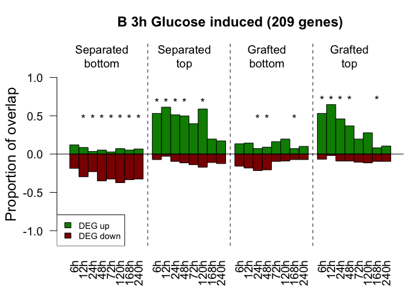

Reproducible script for the publication
================
Alexander Gabel
12 9 2017

Charles W. Melnyk, Alexander Gabel, Thomas J. Hardcastle, Sarah Robinson, Shunsuke Miyashima, Ivo Grosse and Elliot M. Meyerowitz. **Transcriptome dynamics at *Arabidopsis* graft junctions reveal an intertissue recognition mechanism that activates vascular regeneration**. PNAS. (2018). <https://doi.org/10.1073/pnas.1718263115>.

Contents
--------

-   [Getting started](#start)
    -   [Installation](#Installation)
    -   [Data](#data)
-   [Visualization](#vis)
    -   [Hierarchical clustering](#Dendrogram)
    -   [Principle component analysis](#PCA)
-   [Define differentially expressed genes](#DefDEG)
-   [Integrate previously published datasets](#intPubs)
-   [Transcriptional overlap](#transOverlap)
-   [Symmetrically and asymetrically expressed genes](#sym_asym)
-   [Genes expressed in graft formation](#graftFormation)
-   [GO enrichment analysis](#GOen)

<a name="start"></a>Getting started
-----------------------------------

### <a name="Installation"></a>Installation of necessary packages

Install and load packages containing the functions for the analyses

``` r
install.packages("devtools")
install.packages("readxl")
devtools::install_github("GraftingScripts")
library(GraftingScripts)
library(readxl)
```

### <a name="data"></a> Load expression data

Loading length normed expression data generated by BaySeq

``` r
data(exp.data)
```

### Calculate TPMs and summarize replicates

Next, we calculate the corresponding TPM values based on the length normed data and also the TPM expression matrix based on the summarized replicates.

``` r
exp.data.tpm <- apply(exp.data,2,function(i)i/sum(i)*10^6)
exp.data.tpm.sum <- sapply(seq(1,by=2,length.out=ncol(exp.data)/2),function(i){
                           # calculating the geometric mean of biological replicates
                           exp_col <- exp(rowMeans(log(exp.data[,c(i,i+1)]))) 
                           exp_col/sum(exp_col) * 1e6
                           })
colnames(exp.data.tpm.sum) <- gsub(pattern = "A|B", replacement = "h", 
                                   x = colnames(exp.data)[seq(1, by=2, length.out = ncol(exp.data)/2)])
```

<a name="vis"></a> Visualization
--------------------------------

### <a name="Dendrogram"></a>Generating dendrogram based on summarized replicates

To visualize the similarity of the different samples (conditions) we calculated the *pearson* correlation coefficient between each sample and used the measure 1-correlation as a similarity score to perform a hierarchical clustering. The following code snippet applies the *plot\_colored\_dendrogram* function to perform these calculations and plot the resulting dendrogram. The data *groupS* is necessary for the function for later color coding the different samples in the tree.

``` r
data(groupS)
plot_colored_dendrogram(exp_data = exp.data.tpm.sum, groups = groupS)
```


### <a name="PCA"></a>Generating PCA plot

Another way of visualizing the data and how the different samples cluster is the principle component analysis, which can be applied by the following function call. Alternatively to the PCA this function can also generate a MDS plot if the parameter *do.MDS = TRUE*.

``` r
GraftingScripts::plotPCA(exp_data = exp.data.tpm.sum, plot_time_points = T, groups = groupS, do.MDS = F, cex=5, do.legend = T, log=T)
```


<a name="DefDEG"></a>Define differentially expressed genes
----------------------------------------------------------

### Calculate Fold changes against the intact samples

In the next step we calculated for each time point of the grafted and separated samples the foldchanges to the corresponding intact samples, beginning at 6 hours after separation/grafting.

``` r
fc.exp.data <- exp.data.sum[,-which(colnames(exp.data.sum.tpm) %in% "0h Intact")]
fc.list <- list()
sample.Indices <- 9:16
for(i in 1:(ncol(fc.exp.data)/8-1)){
  fc.list[[i]] <- log2(fc.exp.data[,sample.Indices]+1) - log2(fc.exp.data[,1:8]+1)
  sample.Indices <- sample.Indices + 8 
}
names(fc.list) <- unique(unlist(lapply(strsplit(x=colnames(fc.exp.data),split=" "),function(i)paste(i[-1],collapse = " "))))[-1]
```

For the definition of differentially expression we used additionally the marginal likelihoods from our [baySeq](https://www.bioconductor.org/packages/release/bioc/html/baySeq.html) analysis. The data is stored in two lists `ml.list.up` containing the marginal likelihoods of grafted and separated samples in the case that they are upregulated compared to the intact samples. The list `ml.list.down` contains the marginal likelihoodsin the case that the grafted or separated samples are downregulated compared to the intact samples. \#\#\# Integrate the marginal likelihoods from BaySeq

``` r
data(ml.list.up)
data(ml.list.down)
```

<a name="intPubs"></a> Load the gene sets from previous publications
--------------------------------------------------------------------

In this step we load the gene sets from previously published datasets which we investigated in our study. In this code snippet we extract all ids from the excel sheets and put them into our `gene_list`. If the ids seem to be probe ids we use the [biomartR](https://academic.oup.com/bioinformatics/article-lookup/doi/10.1093/bioinformatics/btw821) package to match the corresponding gene id to the probe id. After all gene sets are in the list we add two additional random lists, which later should not show any statistical significance. The `gene_list` object is stored in the GraftingScripts package and can be loaded by `data(gene_lists)`.

``` r
xl_file <- system.file("extdata", "all_gene_subsets_from_manuscript_original.xlsx", package="GraftingScripts") 
sheet_names <- excel_sheets(xl_file)
gene_lists <- list()

for(i in seq_along(sheet_names)){

  gset <- as.matrix(read_excel(xl_file,sheet = sheet_names[i], col_names = F))[,1]
  gset <- unlist(lapply(strsplit(x = gset,split = ";| /// "),function(i)i[1:length(i)]))
  gset <- gsub(pattern = "\\*| ",replacement = "",x = gset)

  # separate gene_ids (beginning with AT) from possible probe_ids (beginning with numbers)
  gset_gene_ids <- gset[grepl(pattern = "^AT", x = gset, ignore.case = T)]
  gset_probe_ids <- gset[grepl(pattern = "^[0-9]", x = gset, ignore.case = T)]

  if(length(gset_probe_ids) > 0){
    # convert probe ids into gene ids with biomartr
    gset_gene_ids_from_probes <- biomartr::biomart(genes = gset_probe_ids, mart = "plants_mart", 
                                                   dataset = "athaliana_eg_gene", filters = "affy_ath1_121501", 
                                                   attributes = "ensembl_gene_id")[,2]
    gset <- unique(toupper(gset_gene_ids_from_probes), toupper(gset_gene_ids))
  }else{
    gset <- unique(toupper(gset_gene_ids))
  }
  gene_lists[[i]] <- gset
}
names(gene_lists) <- sheet_names

set.seed(10)
gene_lists[[length(gene_lists)+1]] <- sample(250, x=rownames(exp.data))
gene_lists[[length(gene_lists)+1]] <- sample(500, x=rownames(exp.data))
 
names(gene_lists)[(length(gene_lists)-1):(length(gene_lists))] <- c("250_random","500_random")
```

<a name="transOverlap"></a> Calculate transcriptional overlap plots and check significance
------------------------------------------------------------------------------------------

In this step we calculate the transcriptional overlap of up- and down- regulated genes from previously published datasets compared to our transcriptome dataset. First, we defined a foldchange threshold and a marginal likelihood threshold to define if a gene is differentially expressed. Afterwards we go through the lists of published gene sets and take only those genes which are differentially expressed in our dataset. Second, we tested if the ratio of up- and down- regulated differentially expressed genes in a published is significantly different to the ratio of up- and down- regulated genes in the complete transcriptome dataset. This is done by the function `do_fisher_up_down`. After all test are performed and all p-values are calculated we correct fo multiple testing with the Benjamini-Yekutieli method. This is done by applying the function `adjust_and_split` which summarizes all p-values, correct them and split the p-values to their original gene list. When all tests are done we call `barplot_up_down` to visualize the transcriptional overlap which means we plot the relative number of published genes which are actually differentially expressed in our dataset.

``` r
for(fc in 1:3){
  
  plot_dir <- paste0("Histogram_abs_logfc_gt_",fc,"_and_ML_gt_0.9")
  
  if(!file.exists(plot_dir)){
    dir.create(plot_dir)
  }
  
  fisher_res_list <- p_val_list <- list()
  
  for(i in seq_along(gene_lists)){
    fisher_res_list[[i]] <- do_fisher_up_down(fc.list, fg.ids=gene_lists[[i]], ml.list.up, ml.list.down, 
                                           fc.threshold = fc, ml.threshold=0.9, alternative = "two.sided")
    p_val_list[[i]] <- fisher_res_list[[i]]$p.val.mat
  }
  
  names(fisher_res_list) <- names(p_val_list) <- names(gene_lists)
  # adjusting p-values with Benjamini & Yekutieli
  adjusted_p_mat_list <- adjust_and_split(p_val_list, "BY")
  names(adjusted_p_mat_list) <- names(p_val_list)
  
  for(i in seq_along(gene_lists)){
    
    glist_name <- names(gene_lists)[i]
    
    up_fc <- fisher_res_list[[i]]$fg.up_fc
    down_fc <- -fisher_res_list[[i]]$fg.down_fc
    
    rownames(up_fc) <- names(ml.list.up)
    rownames(down_fc) <- names(ml.list.down)
    
    rel_up_mat <- t(up_fc/length(fisher_res_list[[i]]$fg.ids))
    rel_down_mat <- t(down_fc/length(fisher_res_list[[i]]$fg.ids))
    
    names_arg <- gsub(pattern = " ",replacement = "\n",rownames(up_fc))
    rect_names <- unlist(lapply(strsplit(colnames(fc.list[[1]])," "),function(l)l[1]))
    
    mainText <- paste0(glist_name," (",length(fisher_res_list[[i]]$fg.ids)," genes)")
    
    filename_prefix <- paste0(plot_dir,"/Histogram_", glist_name)

    pdf(paste0(filename_prefix,"_abs_logFC_gt_",fc,"_ml_gt_09.pdf"),width = 9,height = 6)
    par(mar=c(3.1,4.1,3.1,.1), cex=1.5)
    barplot_up_down(up_mat = rel_up_mat, down_mat = rel_down_mat, p_val_mat = adjusted_p_mat_list[[i]], names.arg = rep(rect_names,4), 
                    main = mainText, labels = names_arg)
    dev.off()
    
  }
}
```



<a name="sym_asym"></a> Defining symmetrically and asymmetrically expressed genes (Table 1)
-------------------------------------------------------------------------------------------

In this step we are interested in the number of genes from previous publications that are overlapping with symmetrically and asymmetrically expressed genes in our dataset defined by a [baySeq](http://www.biorxiv.org/content/early/2017/09/01/183533) clustering. The results from this baySeq analysis can be found in the object `sym_asym_bS`. In the next lines we use each published geneset and calculate the number of intersecting genes with the baySeq clustering. The object overlap\_stats contains the results from the Fisher's exact test, which was used to test if the number of overlapping genes is higher than expected. The resulting p-values from all tests were aagin summarized and corrected against multiple testing with the the *Benjamini-Yekutieli* method. In the last loop of this code snippet the results were summarized in a table and each table is stored in the list `sym_asym_table_list` which can also be loaded from the GraftingScripts package.

``` r
# load genes that are symmetrically or asymmetrically expressed based on BaySeq filtering
data(sym_asym_bS)
number_genes <- nrow(exp.data)

p.val.mat <- exp_num_overlap_genes <- obs_num_overlap_genes <- matrix(nrow=length(gene_lists), ncol=length(sym_asym_bS))
num_gene_sym_asym_bS <- unlist(lapply(sym_asym_bS, length))

for(i in seq_along(gene_lists)){

  glist_name <- names(gene_lists)[i]
  gset <- gene_lists[i]
  
  print(glist_name)
  for(j in seq_along(sym_asym_bS)){
  
    overlap_stats <- test_sym_asym(gene_set_1 = gene_lists[[i]], gene_set_2 = sym_asym_bS[[j]], number_genes_complete = number_genes, alternative = "greater")
    p.val.mat[i,j] <- overlap_stats$p.value
  }
}
colnames(p.val.mat) <- names(sym_asym_bS)
rownames(p.val.mat) <- names(gene_lists)

# Correction of p-values
p.adjusted.mat <- matrix(nrow = nrow(p.val.mat), ncol = ncol(p.val.mat), p.adjust(p.val.mat, method = "BY")) 

rownames(p.adjusted.mat) <- rownames(p.val.mat)
colnames(p.adjusted.mat) <- colnames(p.val.mat)

# Summarizing the results, equivalent to Table 1
baySeq_conditions <- c( "Symm", "Asym_tGb", "Asym_bGt")
names(baySeq_conditions) <- c("Graft Bottom = Top", "Graft Top > Bottom", "Graft Bottom > Top")

sym_asym_table_list <- list()

for(i in seq_along(gene_lists)){
  
  glist_name <- names(gene_lists)[i]
  
  cond_list <- list()
  for(cond in seq_along(baySeq_conditions)){
  
    indices <- grepl(x = colnames(p.adjusted.mat), pattern = baySeq_conditions[cond])
    cond_list[[cond]] <- data.frame(HAG = unlist(lapply(strsplit(x = grep(x = colnames(p.adjusted.mat), 
                                                                          pattern = baySeq_conditions[cond], value = T), 
                                                                 split = "_"), function(c_name)c_name[1])),
                                    Treatment = rep(length(gene_lists[[i]]),8),
                                    baySeq_Condition = num_gene_sym_asym_bS[indices],
                                    Overlap = obs_num_overlap_genes[i, indices], 
                                    check.names = F)
    cond_list[[cond]] <- data.frame(cond_list[[cond]], '%' = round((cond_list[[cond]]$Overlap/cond_list[[cond]]$baySeq_Condition)*100), check.names=F )
    sig_overlap <- p.adjusted.mat[i,indices] < 0.05
    cond_list[[cond]]$`%`[sig_overlap] <- paste0(cond_list[[cond]]$`%`[sig_overlap], "*")  
    colnames(cond_list[[cond]])[2:3] <- c(names(gene_lists)[i],names(baySeq_conditions)[cond])
  }
   sym_asym_table_list[[i]] <- data.frame(cond_list, check.names=F)
}
names(sym_asym_table_list) <- names(gene_lists)
```

| HAG |  S2\_S3h\_CSt3h\_down|  Graft Bottom = Top|  Overlap| %   | HAG |  S2\_S3h\_CSt3h\_down|  Graft Top &gt; Bottom|  Overlap| %   | HAG |  S2\_S3h\_CSt3h\_down|  Graft Bottom &gt; Top|  Overlap| %    |
|:----|---------------------:|-------------------:|--------:|:----|:----|---------------------:|----------------------:|--------:|:----|:----|---------------------:|----------------------:|--------:|:-----|
| 6   |                  1998|                4988|      107| 2   | 6   |                  1998|                   6679|       53| 1   | 6   |                  1998|                   4971|     1563| 31\* |
| 12  |                  1998|                3473|       68| 2   | 12  |                  1998|                   7111|      112| 2   | 12  |                  1998|                   5657|     1526| 27\* |
| 24  |                  1998|                4135|       88| 2   | 24  |                  1998|                   6873|       72| 1   | 24  |                  1998|                   4942|     1525| 31\* |
| 48  |                  1998|                3689|      113| 3   | 48  |                  1998|                   6601|       93| 1   | 48  |                  1998|                   4915|     1427| 29\* |
| 72  |                  1998|               10421|      530| 5   | 72  |                  1998|                   2459|      111| 5   | 72  |                  1998|                   2019|      538| 27\* |
| 120 |                  1998|               15012|      979| 7   | 120 |                  1998|                   1510|       84| 6   | 120 |                  1998|                    941|      210| 22\* |
| 168 |                  1998|               20620|     1615| 8\* | 168 |                  1998|                    464|       25| 5   | 168 |                  1998|                    339|       26| 8    |
| 240 |                  1998|               22586|     1736| 8\* | 240 |                  1998|                    321|       32| 10  | 240 |                  1998|                    230|       26| 11   |

<a name="graftFormation"></a> Expression of DEGs during graft formation
-----------------------------------------------------------------------

In this step we were interested in genes that are specifically expressed in grafted top, grafted bottom and grafted bottom and top. These three gene sets were also determined by baySeq and can be found in the object `baySeq_grafting_lists`. The aim was now to use these gene sets and find an overlap to previously published datasets of graft formation studies. The procedure is almost the same as in the previous step. We took each of the gene sets from graft formation studies and calculated for each time point the overlap to baySeq clusters of graft specific differentially expressed genes. To test if the overlap is significant we used the same Fisher's exact test as in the previous step and performed after all tests the Benjamini-Yekutieli correction method. After the siginicances are calculated we apply the function `barplot_graft_formation` to visualize the number of overlapping genes from each publication with the grafting clusters defined by baySeq at each given time point.

``` r
data(baySeq_grafting_lists)
data(graft_gene_lists)
geneUniverse <- rownames(exp.data)
intersect_lists <- list()
for(i in seq_along(graft_gene_lists)){
  
  pub_gene_set <- graft_gene_lists[[i]]
  
  count_mat <- matrix(nrow=length(baySeq_grafting_lists), ncol=8) # 8 time points
  pval_mat <- matrix(nrow=length(baySeq_grafting_lists), ncol=8)
  col_names <- c()
  intersect_lists[[i]] <- list()
  
  for(treat in seq_along(baySeq_grafting_lists)){
  
    sub_list <- baySeq_grafting_lists[[treat]]
    cur_col <- 1
    
    merge_gene_ids <- c()
    
    for(j in seq_along(sub_list)){
      
      check_list <- list(sub_list[[j]], pub_gene_set)
      names(check_list) <- c(names(sub_list)[j], names(graft_gene_lists)[i])
      
      inter_stats <- intersect.analysis(gene.list = check_list, geneUniverse = geneUniverse, alternative = "greater")
      
      count_mat[treat, j] <- inter_stats$stat[1]
      pval_mat[treat, j] <- inter_stats$stat[2]
      
      if(treat == 1){
        col_names <- c(col_names, paste0(names(sub_list)[j],"h_",names(graft_gene_lists)[i]))
      }
    }
  }
  
  rownames(count_mat) <- rownames(pval_mat) <- names(baySeq_grafting_lists)
  colnames(count_mat) <- colnames(pval_mat) <- col_names
  
  intersect_lists[[i]][[1]] <- count_mat
  intersect_lists[[i]][[2]] <- pval_mat
  names(intersect_lists[[i]]) <- c("Counts","Pvalues")
}
names(intersect_lists) <- names(graft_gene_lists)

adjusted_p_mat_list <- GraftingScripts::adjust_and_split(lapply(intersect_lists, function(mat_list) mat_list[[2]]), "BY")
names(adjusted_p_mat_list) <- names(graft_gene_lists)

for(i in seq_along(intersect_lists)){
  #par(mar=c(3.1,3.1,3.1,.1), xpd=F, mgp=c(2,1,0), cex=1.5)
  GraftingScripts::barplot_graft_formation(count_mat = intersect_lists[[i]]$`Counts`, 
                                           pval_mat = adjusted_p_mat_list[[i]], main = names(intersect_lists)[i])
  intersect_lists[[i]][[3]] <- adjusted_p_mat_list[[i]]
  names(intersect_lists[[i]])[3] <- "adjusted.Pvalues"
}
```


<a name="GOen"></a> GO enrichment
---------------------------------

The GO enrichment analysis is the last step of this script. Here we used each by *baySeq* predefined cluster of grafted top, grafted bottom, and grafted top and bottom gene set at each time point and determined the corresponding GO terms. To test if a certain GO term is significantly enriched in a defined gene set we used the hypergeometric test from the R package [GOstats](https://www.bioconductor.org/packages/release/bioc/html/GOstats.html) to calculate the corresponding p-value. After all GO terms were tested against a gene set, we used the *Bonferroni* method to correct against multiple testing. To call a GO term significant enriched the adjusted p-value had to be smaller than 0.05. The results of the GO enrichment analysis can be loaded with `data(go_result_lists)`.

``` r
go_result_lists <- list()
go_ontologies <- c("BP","MF","CC")
geneUniverse <- rownames(exp.data)

sapply(seq_along(baySeq_grafting_lists), function(i){
  go_result_lists[[i]] <<- list() 
  sapply(seq_along(baySeq_grafting_lists[[i]]), function(j){
  
    go_result_lists[[i]][[j]] <<- list() 
    if(length(baySeq_grafting_lists[[i]][[j]]) > 0){
      sapply(seq_along(go_ontologies), function(o){
        
          print(paste0(names(baySeq_grafting_lists)[i]," - ",names(baySeq_grafting_lists[[i]])[j],"hrs - ",go_ontologies[o]))
          go_result_lists[[i]][[j]][[o]] <<- GraftingScripts::Compute_GO_Enrichment(geneUniverse = geneUniverse, selectedGeneIds = baySeq_grafting_lists[[i]][[j]], 
                                                                                    pvalueCutoff = 0.05, ontology = go_ontologies[o])
            
      })
      names(go_result_lists[[i]][[j]]) <- go_ontologies
    }
  })
  names(go_result_lists[[i]]) <- names(baySeq_grafting_lists[[i]])
})
names(go_result_lists) <- names(baySeq_grafting_lists)
```

### 48 hours after grafting; genes expressed only in grafted bottom samples. Top 20 BP GO terms:

| GOBPID       | Pvalue   | Pvalue.adjusted | OddsRatio | ExpCount | Count | Size | Term                                           |
|:-------------|:---------|:----------------|:----------|:---------|:------|:-----|:-----------------------------------------------|
| <GO:0010200> | 4.77e-70 | 4.10e-67        | 3.57e+01  | 3.65e+00 | 69    | 421  | response to chitin                             |
| <GO:0010243> | 6.10e-69 | 5.25e-66        | 3.42e+01  | 3.78e+00 | 69    | 436  | response to organonitrogen compound            |
| <GO:1901698> | 7.30e-51 | 6.28e-48        | 1.71e+01  | 6.83e+00 | 69    | 789  | response to nitrogen compound                  |
| <GO:0009719> | 4.14e-41 | 3.56e-38        | 9.27e+00  | 1.67e+01 | 86    | 1929 | response to endogenous stimulus                |
| <GO:0002679> | 2.72e-37 | 2.34e-34        | 4.74e+01  | 1.05e+00 | 31    | 121  | respiratory burst involved in defense response |
| <GO:0045730> | 2.72e-37 | 2.34e-34        | 4.74e+01  | 1.05e+00 | 31    | 121  | respiratory burst                              |
| <GO:1901700> | 3.47e-36 | 2.98e-33        | 7.70e+00  | 2.04e+01 | 88    | 2355 | response to oxygen-containing compound         |
| <GO:0010033> | 6.52e-34 | 5.61e-31        | 6.88e+00  | 2.47e+01 | 93    | 2851 | response to organic substance                  |
| <GO:0006952> | 6.45e-31 | 5.54e-28        | 7.71e+00  | 1.39e+01 | 69    | 1603 | defense response                               |
| <GO:0002376> | 1.15e-30 | 9.90e-28        | 9.53e+00  | 8.54e+00 | 56    | 986  | immune system process                          |
| <GO:0002252> | 3.44e-29 | 2.96e-26        | 1.93e+01  | 2.42e+00 | 34    | 280  | immune effector process                        |
| <GO:0042221> | 6.25e-26 | 5.38e-23        | 5.14e+00  | 3.26e+01 | 95    | 3760 | response to chemical                           |
| <GO:0035556> | 3.84e-25 | 3.30e-22        | 1.28e+01  | 3.73e+00 | 36    | 431  | intracellular signal transduction              |
| <GO:0006950> | 1.40e-21 | 1.21e-18        | 4.43e+00  | 3.35e+01 | 90    | 3872 | response to stress                             |
| <GO:0009611> | 9.09e-21 | 7.81e-18        | 1.27e+01  | 2.90e+00 | 29    | 335  | response to wounding                           |
| <GO:0007165> | 1.34e-20 | 1.15e-17        | 5.66e+00  | 1.36e+01 | 56    | 1576 | signal transduction                            |
| <GO:0070887> | 6.89e-20 | 5.93e-17        | 5.90e+00  | 1.16e+01 | 51    | 1344 | cellular response to chemical stimulus         |
| <GO:0050896> | 1.71e-19 | 1.47e-16        | 3.92e+00  | 5.53e+01 | 114   | 6386 | response to stimulus                           |
| <GO:0044700> | 1.89e-19 | 1.63e-16        | 5.31e+00  | 1.44e+01 | 56    | 1668 | single organism signaling                      |
| <GO:0023052> | 1.94e-19 | 1.67e-16        | 5.31e+00  | 1.45e+01 | 56    | 1669 | signaling                                      |

### 120 hours after grafting; genes expressed only in grafted top + grafted bottom samples. Top 20 BP GO terms:

| GOBPID       | Pvalue   | Pvalue.adjusted | OddsRatio | ExpCount | Count | Size | Term                                                  |
|:-------------|:---------|:----------------|:----------|:---------|:------|:-----|:------------------------------------------------------|
| <GO:0044036> | 8.54e-11 | 9.86e-08        | 6.05e+00  | 4.33e+00 | 23    | 309  | cell wall macromolecule metabolic process             |
| <GO:0048507> | 5.78e-10 | 6.67e-07        | 4.50e+00  | 7.02e+00 | 28    | 501  | meristem development                                  |
| <GO:0010067> | 5.84e-10 | 6.75e-07        | 1.44e+02  | 1.26e-01 | 6     | 9    | procambium histogenesis                               |
| <GO:0010065> | 1.44e-09 | 1.67e-06        | 1.08e+02  | 1.40e-01 | 6     | 10   | primary meristem tissue development                   |
| <GO:0010087> | 3.45e-09 | 3.99e-06        | 1.01e+01  | 1.50e+00 | 13    | 107  | phloem or xylem histogenesis                          |
| <GO:0010410> | 3.87e-09 | 4.47e-06        | 6.84e+00  | 2.82e+00 | 17    | 201  | hemicellulose metabolic process                       |
| <GO:0010413> | 6.43e-09 | 7.42e-06        | 7.11e+00  | 2.55e+00 | 16    | 182  | glucuronoxylan metabolic process                      |
| <GO:0045492> | 6.95e-09 | 8.03e-06        | 7.07e+00  | 2.57e+00 | 16    | 183  | xylan biosynthetic process                            |
| <GO:0045491> | 8.79e-09 | 1.01e-05        | 6.95e+00  | 2.61e+00 | 16    | 186  | xylan metabolic process                               |
| <GO:0071554> | 9.67e-09 | 1.12e-05        | 3.27e+00  | 1.24e+01 | 36    | 883  | cell wall organization or biogenesis                  |
| <GO:0044038> | 1.72e-08 | 1.99e-05        | 6.59e+00  | 2.73e+00 | 16    | 195  | cell wall macromolecule biosynthetic process          |
| <GO:0070592> | 1.72e-08 | 1.99e-05        | 6.59e+00  | 2.73e+00 | 16    | 195  | cell wall polysaccharide biosynthetic process         |
| <GO:0070589> | 1.72e-08 | 1.99e-05        | 6.59e+00  | 2.73e+00 | 16    | 195  | cellular component macromolecule biosynthetic process |
| <GO:0010014> | 1.98e-08 | 2.29e-05        | 7.07e+00  | 2.40e+00 | 15    | 171  | meristem initiation                                   |
| <GO:0010383> | 4.80e-08 | 5.54e-05        | 5.68e+00  | 3.34e+00 | 17    | 238  | cell wall polysaccharide metabolic process            |
| <GO:0042546> | 1.11e-07 | 1.28e-04        | 4.54e+00  | 4.86e+00 | 20    | 347  | cell wall biogenesis                                  |
| <GO:0010075> | 1.41e-07 | 1.62e-04        | 6.54e+00  | 2.40e+00 | 14    | 171  | regulation of meristem growth                         |
| <GO:0010051> | 1.59e-07 | 1.84e-04        | 8.99e+00  | 1.40e+00 | 11    | 100  | xylem and phloem pattern formation                    |
| <GO:0007389> | 1.60e-07 | 1.85e-04        | 4.43e+00  | 4.98e+00 | 20    | 355  | pattern specification process                         |
| <GO:0009933> | 1.72e-07 | 1.99e-04        | 5.16e+00  | 3.64e+00 | 17    | 260  | meristem structural organization                      |
